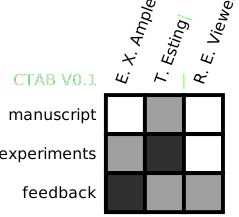

# Export formats

> {{ $frontmatter.draft_reminder }}

In order to make usage of the {{ $frontmatter.table_name }} as easy as possible, it is important the table can be exported into formats that are native to the medium used for writing and display. The `raw-format` is the fundamental representation of a {{ $frontmatter.table_name }}.

**Whenever possible, the table should also lend itself to be copy-able in the the `raw-format` outlined in the main spec.** 

All the different formats below will be supported by the web-editor. [Use the web-editor](https://try-ctab.github.io/#/editor) to quickly generate a {{ $frontmatter.table_name }}.

::: tip Reminder
It will be tempting to include a rasterised image version (i.e. PNG or JPEG) in manuscripts. While the option will be offered in the official editor, this practice is highly discouraged. 
:::

## Web-Editor link

The web-editor allows your generated  {{ $frontmatter.table_name }} to be shared via a link. This allows you to **send your  {{ $frontmatter.table_name }} to collaborators** for them to add their own contributions, or add new categories. 

> They would open the link, make the changes in the web-editor, export it as a new editor link, and simply send that back to you.

An editor-link (query) looks like:

`<base-url>?version=0.1&cols=person1,person2,person3&rows=manuscript,experiments,feedback&contributions=0,1,2~1,2,1~0,0,1`

Let's expand that so we can get a better idea at what is going on

```
?version=0.1&
cols=dave,bob,susan&
rows=manuscript,experiments,feedback&
contributions=0,1,2~1,2,1~0,0,1
```

The first parameter indicates the version of the {{ $frontmatter.table_name }}, and might become useful in the future if different versions of the standard get conceived and we want to retain backwards compatibility.

The second parameter, `cols`, is a comma-separated list of the different column labels. Often the names of the authors would be the column labels.

The third parameter, `rows`, is a comma-separated list of the different row labels. These row labels indicate the different `categories` of your table and can indicate e.g. an experimental technique.

The last parameter, `contributions` is a series of comma-separated arrays which are themselves separated by `~`. Each comma-separated array indicates the contributions **for a single column**. In the example above **0,1,2**~1,2,1~0,0,1 indicates the contribution of **dave** in the different categories.

The web-editor will check if the provided query is a valid table, and if not it will notify the user of the error via the console and **not** display the (faulty) table.

## LaTeX table

CTAB's can be exported in `LaTeX` format. The following packages are required to make the styled version work.

* array
* xcolor
* graphicx
* hhline

> You may already use some of these in your `LaTeX` doc. When you export your CTAB as `LaTeX` it will copy the section below to clipboard. The package import statements are commented, as they would have to be put at the start of the document.

```latex
% Contribution table generated by https://try-ctab.github.io/#/editor 
% \usepackage{array} 
% \usepackage[table]{xcolor} 
% \usepackage{graphicx} 
% \usepackage{hhline} 
\newcommand*\rot{\rotatebox{90}} 
\setlength{\arrayrulewidth}{0.7mm} 
\renewcommand{\arraystretch}{2.1} 
\definecolor{version}{HTML}{DCDCDC}
\definecolor{background}{HTML}{FFFFFF}
\definecolor{C1}{HTML}{FFFFFF}
\definecolor{C2}{HTML}{A0A0A0}
\definecolor{C3}{HTML}{303030}
\begin{tabular}{ r | m{0.5cm} | m{0.5cm} | m{0.5cm} | } 
\multicolumn{1}{c}{\textcolor{version}{CTAB V0.1\textcolor{background}{|}}} & \multicolumn{1}{c}{\rot{E. X. Ample\textcolor{background}{|}}} & \multicolumn{1}{c}{\rot{T. Esting\textcolor{background}{|}}} & \multicolumn{1}{c}{\rot{R. E. Viewer\textcolor{background}{|}}} \\ 
\hhline{~|-|-|-|} 
\textcolor{background}{|}manuscript\textcolor{background}{|} & \cellcolor{C1}\textcolor{C1}{|} & \cellcolor{C2}\textcolor{C2}{*|} & \cellcolor{C1}\textcolor{C1}{|} \\ 
\hhline{~|-|-|-|} 
\textcolor{background}{|}experiments\textcolor{background}{|} & \cellcolor{C2}\textcolor{C2}{*|} & \cellcolor{C3}\textcolor{C3}{**|} & \cellcolor{C1}\textcolor{C1}{|} \\ 
\hhline{~|-|-|-|} 
\textcolor{background}{|}feedback\textcolor{background}{|} & \cellcolor{C3}\textcolor{C3}{**|} & \cellcolor{C2}\textcolor{C2}{*|} & \cellcolor{C2}\textcolor{C2}{*|} \\ 
\hhline{~|-|-|-|} 
\end{tabular}
```
#### Minimal version (no additional packages)

In case your `LaTeX` compiler or set of packages gives problem with the formatted table, you can also use a minimal version. It will look something like:

```
% Contribution table (no-package mode) generated by https://try-ctab.github.io/#/editor
\setlength{\arrayrulewidth}{0.7mm} 
\renewcommand{\arraystretch}{2.1} 
\begin{tabular}{ r | c | c | c | } 
\multicolumn{1}{c}{CTAB V0.1} & \multicolumn{1}{c}{E. X. Ample} & \multicolumn{1}{c}{T. Esting} & \multicolumn{1}{c}{R. E. Viewer} \\ 
\cline{2-4} 
manuscript &  & * &  \\ 
\cline{2-4} 
experiments & * & ** &  \\ 
\cline{2-4} 
feedback & ** & * & * \\ 
\cline{2-4} 
\end{tabular}
```

## SVG (and .PDF)

CTABs can be exported as Scalable Vector Graphics (SVG). SVG files can be opened in any good drawing program such as `Adobe Illustrator` and `Inkscape`. This means you can easily integrate a CTAB into an existing figure or add your own touches (e.g. change colours, add annotations.)

This then also allows you to export your CTAB as a `.PDF`. Open the SVG file in your editor and export as a PDF.



## Word (.docx)

The web-editor has the option to export as a Microsoft Office compatible table. Under the hood, this makes use of the `HTML` export option. The web editor will simply generate the HTML page and copy the HTML table to clipboard. Office will then recognise this when pasting in content and style it as well as it can. The table will be pasted as a 'native' Office table and hence it supports all the MS Office table features, allowing you to tune it as you would a regular MS Office table.

Unfortunately, only a small subset of CSS is  supported by Office, and hence the column labes (e.g. Author names) are not rotated when pasting in the table. 

::: tip 
After pasting in your contribution table into Microsoft Office, manually rotate the text 90 degrees to keep the table compact! 
:::

As an alternative to native Word tables (which, as listed above, have some formatting challenges), you can also:

1.  paste in an [svg CTAB](./#svg-and-pdf) into your Word file. (_drag and drop the `.svg` file into the Word window_)
2. Click on the pasted figure and select `convert to shape`

> This will result in a CTAB that is formatted properly, but is harder to edit.

::: tip 
Whatever method you use to display a CTAB in your document, be sure to also include the `editor link` (e.g. as a comment) used to generate it. That way your colleagues can easily edit it and paste an updated version!

:::

## HTML

The web-editor has the option to export to HTML. This option will open in a new tab and display a styled html representation as given below. This can be copied or screenshot for pasting in any program that accepts a `HTML` template or on a webpage. 

<html>
<body>
<table class="CTAB" style="background-color: transparent; border: none; background-repeat: no-repeat; box-sizing: inherit; padding: 5rem 0px 0px; --gridsize: 40px; border-collapse: collapse; border-spacing: 0px; color: rgba(0, 0, 0, 0.87); font-family: Roboto, sans-serif; font-size: 16px; font-style: normal; font-variant-ligatures: normal; font-variant-caps: normal; font-weight: 400; letter-spacing: normal; orphans: 2; text-align: start; text-transform: none; white-space: normal; widows: 2; word-spacing: 0px; -webkit-text-stroke-width: 0px; background-color: rgb(255, 255, 255); text-decoration-thickness: initial; text-decoration-style: initial; text-decoration-color: initial;"><tr style="background-repeat: no-repeat; box-sizing: inherit; padding: 0px; margin: 0px;"><td class="CTAB-meta" style="background-repeat: no-repeat; box-sizing: inherit; padding: 0px; margin: 0px; color: rgb(232, 232, 232); font-weight: bold;">CTAB V0.1</td><td class="CTAB-column-anchor" style="background-repeat: no-repeat; box-sizing: inherit; padding: 0px; margin: 0px; position: relative;"><div class="CTAB-column" style="background-repeat: no-repeat; box-sizing: inherit; padding: 0px; margin: 0px; white-space: nowrap; position: absolute; bottom: 0px; left: 15px; transform-origin: left center; transform: rotate(-70deg); width: 100px;">E. X. Ample</div></td><td class="CTAB-column-anchor" style="background-repeat: no-repeat; box-sizing: inherit; padding: 0px; margin: 0px; position: relative;"><div class="CTAB-column" style="background-repeat: no-repeat; box-sizing: inherit; padding: 0px; margin: 0px; white-space: nowrap; position: absolute; bottom: 0px; left: 15px; transform-origin: left center; transform: rotate(-70deg); width: 100px;">T. Esting</div></td><td class="CTAB-column-anchor" style="background-repeat: no-repeat; box-sizing: inherit; padding: 0px; margin: 0px; position: relative;"><div class="CTAB-column" style="background-repeat: no-repeat; box-sizing: inherit; padding: 0px; margin: 0px; white-space: nowrap; position: absolute; bottom: 0px; left: 15px; transform-origin: left center; transform: rotate(-70deg); width: 100px;">R. E. Viewer</div></td></tr><tr style="background-repeat: no-repeat; box-sizing: inherit; padding: 0px; margin: 0px;"><td class="CTAB-row" style="background-repeat: no-repeat; box-sizing: inherit; padding: 0px 0.6rem 0px 0px; margin: 0px; white-space: nowrap; text-align: right;">manuscript</td><td class="CTAB-grid-el CTAB-contribution-level-0" style="background-repeat: no-repeat; box-sizing: inherit; padding: 0px; margin: 0px; background-color: white; font-size: 8px; border: 4px solid black; width: var(--gridsize); height: var(--gridsize); color: white;"></td><td class="CTAB-grid-el CTAB-contribution-level-1" style="background-repeat: no-repeat; box-sizing: inherit; padding: 0px; margin: 0px; background-color: rgb(160, 160, 160); font-size: 8px; border: 4px solid black; width: var(--gridsize); height: var(--gridsize); color: rgb(160, 160, 160);">*</td><td class="CTAB-grid-el CTAB-contribution-level-0" style="background-repeat: no-repeat; box-sizing: inherit; padding: 0px; margin: 0px; background-color: white; font-size: 8px; border: 4px solid black; width: var(--gridsize); height: var(--gridsize); color: white;"></td></tr><tr style="background-repeat: no-repeat; box-sizing: inherit; padding: 0px; margin: 0px;"><td class="CTAB-row" style="background-repeat: no-repeat; box-sizing: inherit; padding: 0px 0.6rem 0px 0px; margin: 0px; white-space: nowrap; text-align: right;">experiments</td><td class="CTAB-grid-el CTAB-contribution-level-1" style="background-repeat: no-repeat; box-sizing: inherit; padding: 0px; margin: 0px; background-color: rgb(160, 160, 160); font-size: 8px; border: 4px solid black; width: var(--gridsize); height: var(--gridsize); color: rgb(160, 160, 160);">*</td><td class="CTAB-grid-el CTAB-contribution-level-2" style="background-repeat: no-repeat; box-sizing: inherit; padding: 0px; margin: 0px; background-color: rgb(48, 48, 48); font-size: 8px; border: 4px solid black; width: var(--gridsize); height: var(--gridsize); color: rgb(48, 48, 48);">**</td><td class="CTAB-grid-el CTAB-contribution-level-0" style="background-repeat: no-repeat; box-sizing: inherit; padding: 0px; margin: 0px; background-color: white; font-size: 8px; border: 4px solid black; width: var(--gridsize); height: var(--gridsize); color: white;"></td></tr><tr style="background-repeat: no-repeat; box-sizing: inherit; padding: 0px; margin: 0px;"><td class="CTAB-row" style="background-repeat: no-repeat; box-sizing: inherit; padding: 0px 0.6rem 0px 0px; margin: 0px; white-space: nowrap; text-align: right;">feedback</td><td class="CTAB-grid-el CTAB-contribution-level-2" style="background-repeat: no-repeat; box-sizing: inherit; padding: 0px; margin: 0px; background-color: rgb(48, 48, 48); font-size: 8px; border: 4px solid black; width: var(--gridsize); height: var(--gridsize); color: rgb(48, 48, 48);">**</td><td class="CTAB-grid-el CTAB-contribution-level-1" style="background-repeat: no-repeat; box-sizing: inherit; padding: 0px; margin: 0px; background-color: rgb(160, 160, 160); font-size: 8px; border: 4px solid black; width: var(--gridsize); height: var(--gridsize); color: rgb(160, 160, 160);">*</td><td class="CTAB-grid-el CTAB-contribution-level-1" style="background-repeat: no-repeat; box-sizing: inherit; padding: 0px; margin: 0px; background-color: rgb(160, 160, 160); font-size: 8px; border: 4px solid black; width: var(--gridsize); height: var(--gridsize); color: rgb(160, 160, 160);">*</td></tr></table><!--EndFragment-->
</body>
</html>

Alternatively, a plaintext source representation of the HTML table is shown below the styled table. This offers a human-readable view of the HTML and allows users to quicky apply their own styles to a HTML version of the contribution table. 

An example is shown below. Note that the generated HTML is dynamically generated and hence the `<table>` part will reflect your generated table.

``` html
<table class="CTAB">
	<tr>
		<td class="CTAB-meta">CTAB V0.1</td>
		<td class="CTAB-column-anchor">
			<div class="CTAB-column"> E. X. Ample </div>
		</td>
		<td class="CTAB-column-anchor">
			<div class="CTAB-column"> T. Esting </div>
		</td>
		<td class="CTAB-column-anchor">
			<div class="CTAB-column"> R. E. Viewer </div>
		</td>
	</tr>
	<tr>
		<td class="CTAB-row"> manuscript </td>
		<td class="CTAB-grid-el CTAB-contribution-level-0">  </td>
		<td class="CTAB-grid-el CTAB-contribution-level-1"> * </td>
		<td class="CTAB-grid-el CTAB-contribution-level-0">  </td>
	</tr>
	<tr>
		<td class="CTAB-row"> experiments </td>
		<td class="CTAB-grid-el CTAB-contribution-level-1"> * </td>
		<td class="CTAB-grid-el CTAB-contribution-level-2"> ** </td>
		<td class="CTAB-grid-el CTAB-contribution-level-0">  </td>
	</tr>
	<tr>
		<td class="CTAB-row"> feedback </td>
		<td class="CTAB-grid-el CTAB-contribution-level-2"> ** </td>
		<td class="CTAB-grid-el CTAB-contribution-level-1"> * </td>
		<td class="CTAB-grid-el CTAB-contribution-level-1"> * </td>
	</tr>
</table> 

 <script>
</script> 

 <style> .CTAB {
	 --gridsize: 40px;
	 padding-top: 5rem;
	 margin-top: 5rem;
}
 table.CTAB {
	border-collapse: collapse;
	 border-spacing:}
 .CTAB-meta {
	 color: #E8E8E8;
	 font-weight: bold;
}
 .CTAB-column-anchor {
	 position: relative;
}
 .CTAB-column {
	 white-space: nowrap;
	 position: absolute;
	 bottom: 0px;
	 left: 15px;
	 transform-origin: center left;
	 transform: rotate(-70deg);
	 width: 100px;
}
 .CTAB-row{
	 white-space: nowrap;
	 padding-right: 0.6rem;
	 text-align: right;
}
 .CTAB-grid-el {
	 background-color: floralwhite;
	 font-size: 8px;
	 border: 4px solid black;
	 width: var(--gridsize);
	 height: var(--gridsize);
}
 .CTAB-contribution-level-0 {
	 background-color: white;
	 color: white;
}
 .CTAB-contribution-level-1 {
	 background-color: #A0A0A0;
	 color: #A0A0A0;
}
 .CTAB-contribution-level-2 {
	 background-color: #303030;
	 color: #30303}
 </style>
```
::: tip Try it yourself
To make sure you have the latest version of the generated HTML (as the docs may be slightly behind the editor), simply try it yourself! Go to [the web editor](https://try-ctab.github.io/#/plain-CTAB?version=0.1&cols=E.%20X.%20Ample,T.%20Esting,R.%20E.%20Viewer&rows=manuscript,experiments,feedback&contributions=0,1,2~1,2,1~0,0,1) and have a look.
:::

Using the stylesheet (CSS) you can quickly tweak the appearance to make it fit better with your design language. Keep in mind that the HTML representation cannot directly be converted to **all** formats. But if you are looking for a screenshot or HTML, then it is the quickest way to personalise your  {{ $frontmatter.table_name }}. 

<html>
<body>
<!--StartFragment--><table class="CTAB" style="background-repeat: no-repeat; box-sizing: inherit; padding: 5rem 0px 0px; --gridsize: 40px; font-family: monospace; border-collapse: collapse; border-spacing: 0px; color: rgba(0, 0, 0, 0.87); font-size: 16px; font-style: normal; font-variant-ligatures: normal; font-variant-caps: normal; font-weight: 400; letter-spacing: normal; orphans: 2; text-align: start; text-transform: none; white-space: normal; widows: 2; word-spacing: 0px; -webkit-text-stroke-width: 0px; background-color: rgb(255, 255, 255); text-decoration-thickness: initial; text-decoration-style: initial; text-decoration-color: initial;"><tr style="background-repeat: no-repeat; box-sizing: inherit; padding: 0px; margin: 0px;"><td class="CTAB-meta" style="background-repeat: no-repeat; box-sizing: inherit; padding: 0px; margin: 0px; color: rgb(232, 232, 232); font-weight: bold;">CTAB V0.1</td><td class="CTAB-column-anchor" style="background-repeat: no-repeat; box-sizing: inherit; padding: 0px; margin: 0px; position: relative;"><div class="CTAB-column" style="background-repeat: no-repeat; box-sizing: inherit; padding: 0px; margin: 0px; white-space: nowrap; position: absolute; bottom: 0px; left: 15px; transform-origin: left center; transform: rotate(-70deg); width: 100px;">E. X. Ample</div></td><td class="CTAB-column-anchor" style="background-repeat: no-repeat; box-sizing: inherit; padding: 0px; margin: 0px; position: relative;"><div class="CTAB-column" style="background-repeat: no-repeat; box-sizing: inherit; padding: 0px; margin: 0px; white-space: nowrap; position: absolute; bottom: 0px; left: 15px; transform-origin: left center; transform: rotate(-70deg); width: 100px;">T. Esting</div></td><td class="CTAB-column-anchor" style="background-repeat: no-repeat; box-sizing: inherit; padding: 0px; margin: 0px; position: relative;"><div class="CTAB-column" style="background-repeat: no-repeat; box-sizing: inherit; padding: 0px; margin: 0px; white-space: nowrap; position: absolute; bottom: 0px; left: 15px; transform-origin: left center; transform: rotate(-70deg); width: 100px;">R. E. Viewer</div></td></tr><tr style="background-repeat: no-repeat; box-sizing: inherit; padding: 0px; margin: 0px;"><td class="CTAB-row" style="background-repeat: no-repeat; box-sizing: inherit; padding: 0px 0.6rem 0px 0px; margin: 0px; white-space: nowrap; text-align: right;">manuscript</td><td class="CTAB-grid-el CTAB-contribution-level-0" style="background-repeat: no-repeat; box-sizing: inherit; padding: 0px; margin: 0px; background-color: white; font-size: 8px; border: 7px solid black; width: var(--gridsize); height: var(--gridsize); color: white;"></td><td class="CTAB-grid-el CTAB-contribution-level-1" style="background-repeat: no-repeat; box-sizing: inherit; padding: 0px; margin: 0px; background-color: rgb(255, 128, 153); font-size: 8px; border: 7px solid black; width: var(--gridsize); height: var(--gridsize); color: rgb(255, 128, 153);">*</td><td class="CTAB-grid-el CTAB-contribution-level-0" style="background-repeat: no-repeat; box-sizing: inherit; padding: 0px; margin: 0px; background-color: white; font-size: 8px; border: 7px solid black; width: var(--gridsize); height: var(--gridsize); color: white;"></td></tr><tr style="background-repeat: no-repeat; box-sizing: inherit; padding: 0px; margin: 0px;"><td class="CTAB-row" style="background-repeat: no-repeat; box-sizing: inherit; padding: 0px 0.6rem 0px 0px; margin: 0px; white-space: nowrap; text-align: right;">experiments</td><td class="CTAB-grid-el CTAB-contribution-level-1" style="background-repeat: no-repeat; box-sizing: inherit; padding: 0px; margin: 0px; background-color: rgb(255, 128, 153); font-size: 8px; border: 7px solid black; width: var(--gridsize); height: var(--gridsize); color: rgb(255, 128, 153);">*</td><td class="CTAB-grid-el CTAB-contribution-level-2" style="background-repeat: no-repeat; box-sizing: inherit; padding: 0px; margin: 0px; background-color: rgb(255, 31, 75); font-size: 8px; border: 7px solid black; width: var(--gridsize); height: var(--gridsize); color: rgb(255, 31, 75);">**</td><td class="CTAB-grid-el CTAB-contribution-level-0" style="background-repeat: no-repeat; box-sizing: inherit; padding: 0px; margin: 0px; background-color: white; font-size: 8px; border: 7px solid black; width: var(--gridsize); height: var(--gridsize); color: white;"></td></tr><tr style="background-repeat: no-repeat; box-sizing: inherit; padding: 0px; margin: 0px;"><td class="CTAB-row" style="background-repeat: no-repeat; box-sizing: inherit; padding: 0px 0.6rem 0px 0px; margin: 0px; white-space: nowrap; text-align: right;">feedback</td><td class="CTAB-grid-el CTAB-contribution-level-2" style="background-repeat: no-repeat; box-sizing: inherit; padding: 0px; margin: 0px; background-color: rgb(255, 31, 75); font-size: 8px; border: 7px solid black; width: var(--gridsize); height: var(--gridsize); color: rgb(255, 31, 75);">**</td><td class="CTAB-grid-el CTAB-contribution-level-1" style="background-repeat: no-repeat; box-sizing: inherit; padding: 0px; margin: 0px; background-color: rgb(255, 128, 153); font-size: 8px; border: 7px solid black; width: var(--gridsize); height: var(--gridsize); color: rgb(255, 128, 153);">*</td><td class="CTAB-grid-el CTAB-contribution-level-1" style="background-repeat: no-repeat; box-sizing: inherit; padding: 0px; margin: 0px; background-color: rgb(255, 128, 153); font-size: 8px; border: 7px solid black; width: var(--gridsize); height: var(--gridsize); color: rgb(255, 128, 153);">*</td></tr></table><!--EndFragment-->
</body>
</html>


<html>
<body>
<!--StartFragment--><table class="CTAB" style="background-repeat: no-repeat; box-sizing: inherit; padding: 5rem 0px 0px; --gridsize: 40px; font-family: cursive; border-collapse: collapse; border-spacing: 0px; color: rgba(0, 0, 0, 0.87); font-size: 16px; font-style: normal; font-variant-ligatures: normal; font-variant-caps: normal; font-weight: 400; letter-spacing: normal; orphans: 2; text-align: start; text-transform: none; white-space: normal; widows: 2; word-spacing: 0px; -webkit-text-stroke-width: 0px; background-color: rgb(255, 255, 255); text-decoration-thickness: initial; text-decoration-style: initial; text-decoration-color: initial;"><tr style="background-repeat: no-repeat; box-sizing: inherit; padding: 0px; margin: 0px;"><td class="CTAB-meta" style="background-repeat: no-repeat; box-sizing: inherit; padding: 0px; margin: 0px; color: rgb(232, 232, 232); font-weight: bold; font-size: 1.4rem;">CTAB V0.1</td><td class="CTAB-column-anchor" style="background-repeat: no-repeat; box-sizing: inherit; padding: 0px; margin: 0px; position: relative;"><div class="CTAB-column" style="background-repeat: no-repeat; box-sizing: inherit; padding: 0px; margin: 0px; white-space: nowrap; position: absolute; bottom: 0px; left: 15px; transform-origin: left center; transform: rotate(-70deg); width: 100px;">E. X. Ample</div></td><td class="CTAB-column-anchor" style="background-repeat: no-repeat; box-sizing: inherit; padding: 0px; margin: 0px; position: relative;"><div class="CTAB-column" style="background-repeat: no-repeat; box-sizing: inherit; padding: 0px; margin: 0px; white-space: nowrap; position: absolute; bottom: 0px; left: 15px; transform-origin: left center; transform: rotate(-70deg); width: 100px;">T. Esting</div></td><td class="CTAB-column-anchor" style="background-repeat: no-repeat; box-sizing: inherit; padding: 0px; margin: 0px; position: relative;"><div class="CTAB-column" style="background-repeat: no-repeat; box-sizing: inherit; padding: 0px; margin: 0px; white-space: nowrap; position: absolute; bottom: 0px; left: 15px; transform-origin: left center; transform: rotate(-70deg); width: 100px;">R. E. Viewer</div></td></tr><tr style="background-repeat: no-repeat; box-sizing: inherit; padding: 0px; margin: 0px;"><td class="CTAB-row" style="background-repeat: no-repeat; box-sizing: inherit; padding: 0px 0.6rem 0px 0px; margin: 0px; white-space: nowrap; text-align: right;">manuscript</td><td class="CTAB-grid-el CTAB-contribution-level-0" style="background-repeat: no-repeat; box-sizing: inherit; padding: 0px; margin: 0px; background-color: white; font-size: 8px; border: 1px solid gray; width: 80px; height: var(--gridsize); color: white;"></td><td class="CTAB-grid-el CTAB-contribution-level-1" style="background-repeat: no-repeat; box-sizing: inherit; padding: 0px; margin: 0px; background-color: rgb(240, 227, 43); font-size: 8px; border: 1px solid gray; width: 80px; height: var(--gridsize); color: rgb(240, 227, 43);">*</td><td class="CTAB-grid-el CTAB-contribution-level-0" style="background-repeat: no-repeat; box-sizing: inherit; padding: 0px; margin: 0px; background-color: white; font-size: 8px; border: 1px solid gray; width: 80px; height: var(--gridsize); color: white;"></td></tr><tr style="background-repeat: no-repeat; box-sizing: inherit; padding: 0px; margin: 0px;"><td class="CTAB-row" style="background-repeat: no-repeat; box-sizing: inherit; padding: 0px 0.6rem 0px 0px; margin: 0px; white-space: nowrap; text-align: right;">experiments</td><td class="CTAB-grid-el CTAB-contribution-level-1" style="background-repeat: no-repeat; box-sizing: inherit; padding: 0px; margin: 0px; background-color: rgb(240, 227, 43); font-size: 8px; border: 1px solid gray; width: 80px; height: var(--gridsize); color: rgb(240, 227, 43);">*</td><td class="CTAB-grid-el CTAB-contribution-level-2" style="background-repeat: no-repeat; box-sizing: inherit; padding: 0px; margin: 0px; background-color: rgb(67, 116, 250); font-size: 8px; border: 1px solid gray; width: 80px; height: var(--gridsize); color: rgb(67, 116, 250);">**</td><td class="CTAB-grid-el CTAB-contribution-level-0" style="background-repeat: no-repeat; box-sizing: inherit; padding: 0px; margin: 0px; background-color: white; font-size: 8px; border: 1px solid gray; width: 80px; height: var(--gridsize); color: white;"></td></tr><tr style="background-repeat: no-repeat; box-sizing: inherit; padding: 0px; margin: 0px;"><td class="CTAB-row" style="background-repeat: no-repeat; box-sizing: inherit; padding: 0px 0.6rem 0px 0px; margin: 0px; white-space: nowrap; text-align: right;">feedback</td><td class="CTAB-grid-el CTAB-contribution-level-2" style="background-repeat: no-repeat; box-sizing: inherit; padding: 0px; margin: 0px; background-color: rgb(67, 116, 250); font-size: 8px; border: 1px solid gray; width: 80px; height: var(--gridsize); color: rgb(67, 116, 250);">**</td><td class="CTAB-grid-el CTAB-contribution-level-1" style="background-repeat: no-repeat; box-sizing: inherit; padding: 0px; margin: 0px; background-color: rgb(240, 227, 43); font-size: 8px; border: 1px solid gray; width: 80px; height: var(--gridsize); color: rgb(240, 227, 43);">*</td><td class="CTAB-grid-el CTAB-contribution-level-1" style="background-repeat: no-repeat; box-sizing: inherit; padding: 0px; margin: 0px; background-color: rgb(240, 227, 43); font-size: 8px; border: 1px solid gray; width: 80px; height: var(--gridsize); color: rgb(240, 227, 43);">*</td></tr></table><br class="Apple-interchange-newline"><!--EndFragment-->
</body>
</html>

## XML

## PNG

::: warning
The use of rasterised versions of the {{ $frontmatter.table_name }}  is highly discouraged. The export option is only offered for inclusion in **currently** unsupported formats such as powerpoint.
:::

Currently, the web editor does not natively support PNG exports. You can still generate  `PNG` or `JPEG` representations of a {{ $frontmatter.table_name }} by going to the `HTML` export option in the web-editor and taking a **screenshot** of this page. Use the browser's zoom functionality to ensure you get a high resolution screenshot.
