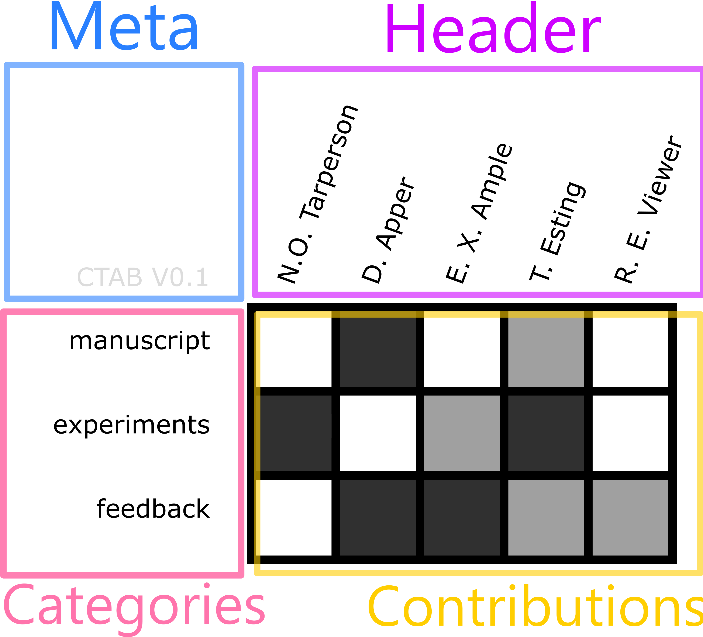

# Draft Specification - CTAB

Welcome to the Draft Specification for the implementation of **Contribution Tables (`CTAB` for short)**. This specification exists so there is one central place where those who wish to either **use** or **implement** a {{ $frontmatter.table_name }} in their manuscripts or journals. 

::: tip
If you are not sure why you would even want to have or use a {{ $frontmatter.table_name }}, please visit the 'motivation' button in the top right. It will give you a lightning introduction to what Contribution Tables are and what they look to replace.
:::

There are a few aspects that the `CTAB` specification should balance
* Flexibility vs. Universality
* Brevity vs. Expressiveness

In addition, the `CTAB` format should have the following:
* Easy to create (for users)
* Easy to make machine-readable
* Offer flexible styling (journals can apply their colours, fonts, etc)
* Have a shared journal-specific config format

:::  warning This is a Draft
Keep in mind that everything you see below is, currently, a proposed draft. Feedback is welcome, and changes are sure to be made along the way.
:::

## Anatomy and terminology

In order to make sense of what a `CTAB` _should_ be, we need to be aware of the anatomy of a `CTAB` (in it's current form) and how we should refer to each aspect.



---

The **`Meta`** part of a CTAB is a section reserved for meta information related to the contribution table. For now it is only used to show the version of the CTAB specification that id adheres to. This is for backwards compatibility. 

The **`Header`** are the labels given to the columns of a CTAB. Note that this does *not* include the `meta` field. In practice, this will often be a list of the authors  in your manuscript. 

> The name **header** is chosen rather than **authors** for the simple reason that it will not **always** be authors that make up the columns of your table. You could also make a CTAB where the columns are different publications you worked on (to show off as a CV).

The **`Categories`** are the labels given to the rows of the CTAB. These specify what the contribution was made **in**. 

The **`Contributions`** section is a table (or heatmap if you want to refer to it as that) that provides a simple 2D representation of the contributions.

---

**In dedicated paragraphs, each element will be discussed, and your feedback on what should and shouldn't be allowed in each anatomical element will be greatly appreciated.**

## The `header` element

The header element can contain:
1. Author names 
2. Paper IDs

As for **Authors names**, it is appropriate to use full last names, and initials. Since a CTAB will take up a decent amount of space, it doesn't make a lot of sense to try to go for ultra-compact names.

If the columns of your CTAB are to show an overview of your contributions over your **publication record**, then I do recommend a compact representation of the publication. It would not be a good idea to have your `header` contain elements that are 50 characters long.

## The `categories` element

::: tip Feedback wanted
This is an aspect of CTAB that is difficult a priori and without input from others. There are arguments to be made for different choices here, and I'd love to hear them.
:::

The `categories` element is, on a basic level, very simple. You worked on something, you simply list it and then label your contribution; easy-peesy, right? Unfortunately, there are some problems with this in practice. Lets look at some problems

#### Problem of specificity

Let's say you purified 3 different proteins of the same family (lets call them B-1,B-2,B-3) for a publication. What `category-label` should you choose for that?

Perhaps you might like to be specific, so you write down `Purification of B-1,B-2,B-3`. Now, thats all good and well, but that would not make it very useful for an overview of your publication record, and it is also very verbose.

Maybe you go for `Purification of B proteins`. This is already less verbose and more general, and might work. But what about just `Purification`? That could work, but what if two people both contributed purification work? Then it might make sense again to differentiate them sometimes.

> How specific should categories be? Are `Experiments` `Manuscript` `Funding` `Conceptualisation` and `Programming` sufficient? Probably not, but what should the limit be on specificty?

#### Problem of spelling and  synonyms 

When it comes to letting everyone choose their own `categories`, is that different spellings (e.g. `analyse` and `analyze`) and synonyms (e.g. `microscopy` and `imaging`) or just slightly different phrasing ( `microscopy` and `microscope work`)  could all make it more difficult to compare and group categories. This would not be a disaster, but one of the nice aspects of CTAB is that it offers an opportunity to make contributions machine readable.

## The `contributions` element  

The `contributions` element should indicate the _degree_ of contributions using colours. The standard way should be white for a contribution of `0` (i.e. no contribution), as it is commonly the background colour of the manuscript. Subsequent levels should have a logical colour order. 

::: warning A last resort
In cases where color is not available for whatever reason, an _acceptable_ fallback is a representation of the contribution-degree with an equivalent number of `*` characters. E.g. `**` for a level 2 contribution.
:::

> At the current time, I would recommend that journals do **not** change these colours unless they have very good reason.

::: tip Feedback wanted
This is an aspect of CTAB that is difficult a priori and without input from others. There are arguments to be made for different choices here, and I'd love to hear them.
:::

The amount of contribution degrees that should be allowed is a question up for debate. Too few and it might not allow you to convey nuances in the contributions that feel appropriate, and we end up in a situation like where we are now where 'first author' is the finest degree of information you can get. Too many, and it becomes difficult to assess the proper contribution level, leading to discussions between authors and make filling in CTAB a real pain in the neck.

**I think it is therefore best to have 3 contribution levels: `0` `1` `2`. Where `0` is no contribution, `1` is a 'minor' contribution and `2` is a major contribution.**

This major minor distinction is just enough to have some nuance to your CTAB, but still be quick and easy to asses when it should be either. If two people did fluorescence microscopy, but one did the majority of the work, then one person gets `major` and the other `minor`. If they both did an equal amount of work, then both get `major`.

> How contribution degrees and levels should be compared **between categories** and **between different publications** is discussed in the next section. 

## What should a contribution be worth and is it an objective measure?

It might be tempting to see a CTAB as a quantitative measure of contribution to a manuscript. This is not what it _should_ be in my opinion. 

#### Within manuscript comparison

If someone spent 100 hours on imaging, and another researcher spent 50 hours on purification, both should get at `major` contribution to each category. This is to avoid having to **judge a colleague's contribution**. 

As a consequence, it also does not mean that the person with the most `major ` contributions also did the most work on the manuscript. A CTAB merely tries to give a quick intuitive overview of <Highlight>who-did-what</Highlight>.

#### Between manuscript comparison

As a CTAB is not a quantitative measure within a single publication, it also surely cannot be _between different_ publications. This is for obvious reasons: how would you compare  a `major` contribution to `e.g.`  "scripting" between different publications? Should it be weighed by number of citations? That a person who published a paper with 100 citations has a higher contribution score than one with two papers with 49 and 40 citations? Even this does not make sense, as different `categories` will have different "importance" between manuscripts. `e.g` a `major` contribution to `x-ray anaylsis` will have a different amount of "work" behind it in a paper on x-ray analysis, versus a paper where a supplementary figure involved a one time x-ray measurement.

As such, it does not make sense to
1. Count the number of contributions as a meaningful number (i.e. 5 contributions to scripting should be considered more meaningful than 12). 
2. Attach any value to the number of contributions. If you average 4 `major` contributions compared to your colleagues `7`, it does not mean that their contribution to papers is higher.

Again, you should see a CTAB as a <Highlight>who-did-what</Highlight> table, not a _productivity readout_.

## Machine readability

CTAB, since they are not long sentences listing contributions, open up interesting possibilities for meta analyses of contributions. Each journal could make the CTAB available in their APIs or at least make it machine readable (e.g. XML format). 

This would allow for interesting trend investigations, such as changes over time in the type of contributions made to a journal over time, or how the typical types of contributions made over time to, say, a typical biology paper change over time.  

## The Raw Format

As the information in a CTAB is simple in nature, it would make sense to have a plaintext representation of it. That way it could be presented in terminals, or simply passed around and saved easily. 

The current version of CTAB has such a representation, which is best referred to as the `Raw Format`. It is a plain, unstyled representation of the contents of a CTAB that is openable in a text editor. It can be human readable, but does not **need** to be formatted tidily. 

An example of a `Raw Format` CTAB is given below.

```
| CTAB V0.1   | N.O. Tarperson | D. Apper | E. X. Ample | T. Esting | R. E. Viewer |
| manuscript  |                |    **    |             |     *     |              |
| experiments |       **       |          |      *      |    **     |              |
| feedback    |                |    **    |     **      |     *     |      *       |
```

> Those familiar with Markdown will notice this is quite similar to the markdown representation of tables.

But note that the text file below is also perfectly valid, _just not very neat_. If you want to check if your `Raw Format` is up to spec, you can try the online [CTAB Raw Format checker](https://nemoandrea.github.io/better-contributions/#/check-CTAB)

```
|CTABV0.1| N.O.Tarperson|D.Apper|E.X. Ample|T. Esting|R.E. Viewer|
|manuscript                       | |**| |*| |
|experiments|**|		|*|**| |
|feedback| |**|**|*|*|
```

The full set of rules for the `Raw Format` are given in the expandable menu below. 

::: details The Raw Format Rules
1. The first and last `|` is optional, but this must be consistent throughout the CTAB
2. Whitespaces **bordering** `|` characters and tabs will be ignored (so spaces in between words will be retained)
3. The first line **must** include the meta field
4. The first line must contain `header` content
5. Numbers are not permitted in the `contributions` section. This is because this is less human-readable. `*` characters are the only permitted symbol, and their number should reflect the contribution-level. 
:::

## The journal-specific config format

While having one rigid set of possible `categories` would be best for _universality_, it would be challenging to draw up such a set for the wide range of journals out there. Each journal can therefore build their own format.

While each journal can draw up their own format, they will be strongly encouraged to pick from a curated list of  `categories` in the [journal config](/for-journals/#journal-specific-config-format) section. This will avoid duplicate categories such as _programming_, _coding_ or, _machine learning_, _ai_, _artificial intelligence_.

For more details on the **journal-specific config format**, see the [For Journals](/for-journals/#curated-categories) section.

## The universal editor

In order to make it as easy as possible for authors to include a Contribution Table in their draft manuscript, a web-tool has been built that allows users to quickly make their own `CTAB`. 

The editor can be tried [here](https://nemoandrea.github.io/better-contributions/editor) or by clicking the **build a table** at the top right.

The editor allows for easy exporting into common formats, and requires no installation.


